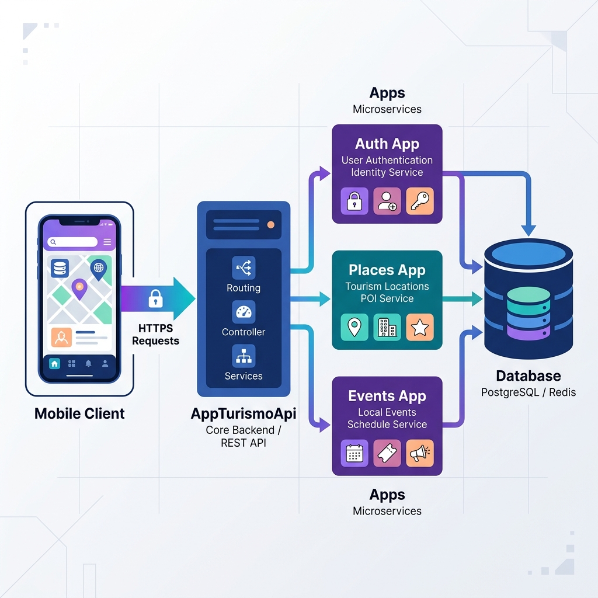

# AppTurismoApi 🏛️🌋



This is the robust, scalable backend for the **Descubre Popayán** mobile ecosystem. Built with **Django 5** and **Django REST Framework (DRF)**, it provides a centralized API for managing tourism resources, user engagement, and secure authentication.

---

## 🏗️ Architectural Pattern

The project follows a **Modular Monolith** architecture with a clear separation of concerns using a **Layered Design** pattern within each application.

### 1. Layered Structure
Each application inside the `apps/` directory follows this internal flow:
*   **Models (`models.py`)**: Defines the data schema and business rules.
*   **Serializers (`api/serializers.py`)**: Handles data validation and transformation (JSON <-> Python).
*   **ViewSets (`api/api.py`)**: Contains the business logic for HTTP requests (GET, POST, etc.).
*   **Routing (`api/urls.py`)**: Maps endpoints to their respective ViewSets.

### 2. Polymorphic Logic (Generic Relations)
One of the most advanced features of this project is the use of **Django ContentTypes**. Instead of creating separate "Favorite" tables for Restaurants, Hotels, and Events, we use a **Polymorphic Pattern** in the `gestiones` app:
*   **`Favorito`**, **`ValoracionComentario`**, and **`EnlaceRedSocial`** can link to *any* entity in the system.
*   This reduces database redundancy and allows for unified management of user interactions across different tourism categories.

### 3. Core Orchestration (`core/`)
The `core/` directory acts as the brain of the project:
*   **Settings**: Modularized configurations for different environments (base, local, production).
*   **URL Routing**: Aggregates all application-specific routes into a single entry point.

---

## 🔐 Security & Authentication

The project implements a **State-of-the-art JWT Authentication** flow:
*   **Statelessness**: Uses JSON Web Tokens (SimpleJWT) to ensure high performance.
*   **Security**: Includes a **Refresh Token Blacklist** mechanism. When a user logs out, their refresh token is invalidated on the server side, preventing unauthorized session hijacking.
*   **Persistence**: Securely handles token rotation to keep users logged in safely.

---

## 📂 Project Roadmap (App Directory)

| App | Responsibility |
| :--- | :--- |
| **`usuarios`** | Identity management, custom User model, and JWT authentication. |
| **`lugaresturisticos`**| Primary tourist spots, historical sites, and their classifications. |
| **`restaurantes`** | Gastronomy management and food services. |
| **`alojamientos`** | Hotels, hostels, and lodging information. |
| **`eventos`** | Cultural and religious events (e.g., Semana Santa). |
| **`gestiones`** | Cross-cutting features: Favorites, Comments, Ratings, and Social Links. |

---

## 🛠️ Technical Stack

*   **Language:** Python 3.10+
*   **Framework:** Django 5.1
*   **API:** Django REST Framework
*   **Database:** PostgreSQL (Robust relational storage)
*   **Auth:** SimpleJWT (OAuth2 compatible flow)
*   **Middleware:** CORS Headers for secure cross-platform communication (Compose Multiplatform).

---

## 🚀 Getting Started

1.  **Clone the repo**
2.  **Create a Virtual Environment**:
    ```bash
    python -m venv venv
    source venv/bin/activate
    ```
3.  **Install Dependencies**:
    ```bash
    pip install -r requirements.txt
    ```
4.  **Configure Environment Variables**:
    Create a `.env` file based on the settings in `core/settings/`.
5.  **Run Migrations**:
    ```bash
    python manage.py migrate
    ```
6.  **Start the Server**:
    ```bash
    python manage.py run server
    ```

---

## 🚀 Deployment (Google Cloud Platform)

This project is optimized for deployment to **Google Cloud Run** using a serverless architecture and **GCP Secret Manager** for sensitive configuration.

### 1. Prerequisites
- [Google Cloud SDK](https://cloud.google.com/sdk/docs/install) installed.
- Authenticated with your GCP account:
  ```bash
  gcloud auth login
  gcloud config set project popayan-descubre
  ```

### 2. Secret Manager Integration
The application fetches its `SECRET_KEY` and `DATABASES` configuration from a secret named `appturismo-django-secrets`. 

**For local development:**
1. Download the Service Account JSON key (`appturismo-key.json`).
2. Set the environment variable:
   ```bash
   export GOOGLE_APPLICATION_CREDENTIALS="/path/to/appturismo-key.json"
   ```

### 3. Deploying to Cloud Run
To build a new revision and deploy it without requiring Docker installed locally:

```bash
gcloud run deploy appturismo-backend \
    --source . \
    --region us-central1 \
    --service-account appturismo-backend@popayan-descubre.iam.gserviceaccount.com \
    --allow-unauthenticated
```

**What this does:**
*   **Cloud Build**: Compiles the `Dockerfile` on Google's infrastructure.
*   **Artifact Registry**: Stores the resulting container image.
*   **Cloud Run**: Spins up the new revision and handles traffic routing.
*   **IAM**: Attaches the Service Account so the container can natively read secrets.

---

## 🛡️ Best Practices Implemented
*   **Audit Trails**: All models inherit from `InformacionBase`, providing automatic `fecha_creacion` and `fecha_actualizacion` timestamps.
*   **Soft Deletion**: Prepared for logical deletion to prevent data loss.
*   **Input Validation**: Strict validation at the serializer level to ensure data integrity.
*   **Modular URLs**: Each app manages its own routing for better maintainability.
